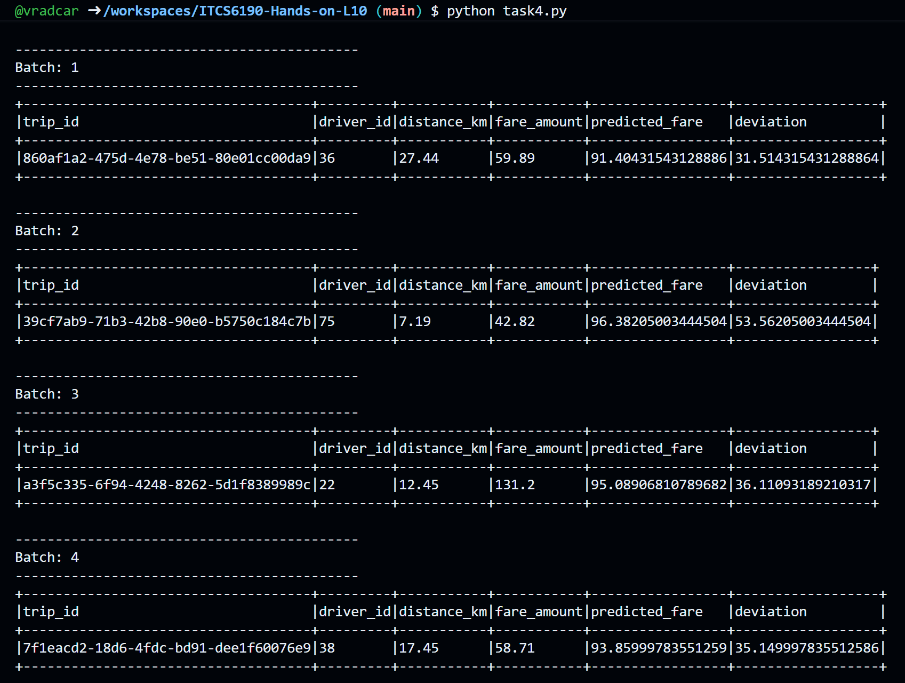
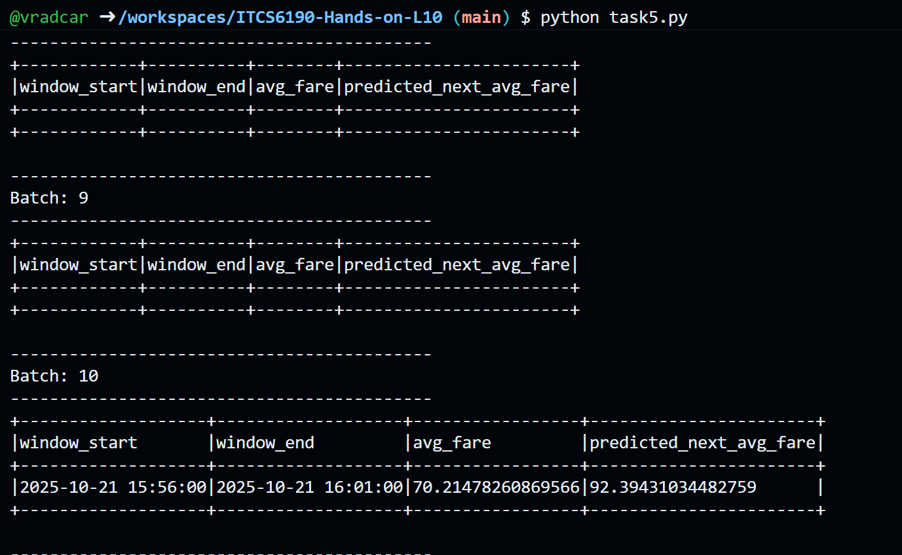
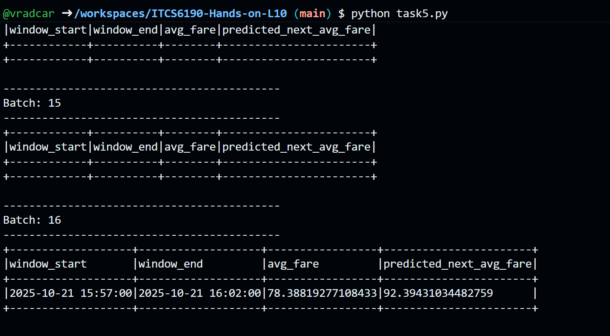

# Handson-L10-Spark-Streaming-MachineLearning-MLlib

## Project Overview
This project implements a real-time analytics pipeline for a ride-sharing platform using Apache Spark Structured Streaming and Spark MLlib. The system processes streaming ride data, trains machine learning models, and performs real-time predictions on fare amounts and fare trends.

## Project Structure
```
ITCS6190-Hands-on-L10/
├── data_generator.py          # Simulates real-time ride-sharing data
├── training-dataset.csv       # Historical training data
├── task4.py                   # Real-Time Fare Prediction Using MLlib Regression
├── task5.py                   # Time-Based Fare Trend Prediction
├── Output/                    # Folder containing output screenshots
│   ├── task4.png             # Task 4 output screenshot
│   └── task5.png             # Task 5 output screenshot
└── README.md                  # Project documentation
```

## Tasks Overview

### Task 4: Real-Time Fare Prediction Using MLlib Regression

#### Objective
Train a Linear Regression model to predict ride fares based on trip distance and apply the model in real-time to detect fare anomalies.

#### Implementation Details

**Offline Model Training:**
1. Load training data from `training-dataset.csv`
2. Cast `distance_km` and `fare_amount` columns to DoubleType
3. Use VectorAssembler to prepare the feature column (distance_km)
4. Create and fit a LinearRegression model
5. Save the trained model to `models/fare_model`

**Real-Time Inference:**
1. Read streaming data from socket (localhost:9999)
2. Parse incoming JSON ride data
3. Load the pre-trained LinearRegressionModel
4. Apply VectorAssembler to streaming data
5. Generate predictions using the model
6. Calculate deviation between actual and predicted fares
7. Display results in console (append mode)

#### Key Features
- **Feature**: `distance_km` (trip distance in kilometers)
- **Label**: `fare_amount` (actual fare in currency units)
- **Prediction**: Predicted fare based on distance
- **Deviation**: Absolute difference between actual and predicted fare (for anomaly detection)

#### Output Format
The streaming output displays:
- `trip_id`: Unique identifier for each trip
- `driver_id`: Driver identifier
- `distance_km`: Trip distance
- `fare_amount`: Actual fare charged
- `predicted_fare`: Model-predicted fare
- `deviation`: Absolute difference (anomaly indicator)

---

### Task 5: Time-Based Fare Trend Prediction

#### Objective
Train a model to predict average fare trends based on time-of-day patterns using windowed aggregations and cyclical time features.

#### Implementation Details

**Offline Model Training:**
1. Load and preprocess training data
2. Aggregate data into 5-minute time windows
3. Calculate average fare for each window
4. Engineer cyclical time features:
   - `hour_of_day`: Hour extracted from window start
   - `minute_of_hour`: Minute extracted from window start
5. Train LinearRegression model on time features
6. Save model to `models/fare_trend_model_v2`

**Real-Time Inference:**
1. Read streaming data from socket
2. Add watermark for late-arriving data (1 minute)
3. Apply 5-minute windowed aggregation (sliding every 1 minute)
4. Engineer same time features for streaming data
5. Load pre-trained trend prediction model
6. Generate predictions for each time window
7. Display window boundaries, actual average, and predicted average

#### Key Features
- **Features**: 
  - `hour_of_day`: Hour of day (0-23)
  - `minute_of_hour`: Minute within hour (0-59)
- **Label**: `avg_fare` (average fare within time window)
- **Prediction**: Predicted average fare for the time window

#### Output Format
The streaming output displays:
- `window_start`: Window start timestamp
- `window_end`: Window end timestamp
- `avg_fare`: Actual average fare in the window
- `predicted_next_avg_fare`: Model-predicted average fare

---

## Setup Instructions

### Prerequisites
- Python 3.8+
- Apache Spark 3.x
- PySpark
- Faker library (for data generation)

### Installation
```bash
# Install required packages
pip install pyspark faker
```

### Running the Application

#### Step 1: Start the Data Generator
Open a terminal and run:
```bash
python data_generator.py
```
This starts a socket server on `localhost:9999` that streams simulated ride data.

#### Step 2: Run Task 4 (Fare Prediction)
Open another terminal and run:
```bash
python task4.py
```
This will:
- Train the fare prediction model (first run only)
- Start consuming streaming data
- Display real-time predictions with deviations

#### Step 3: Run Task 5 (Fare Trend Prediction)
Alternatively, run Task 5:
```bash
python task5.py
```
This will:
- Train the fare trend model (first run only)
- Start consuming streaming data with windowing
- Display time-based fare predictions

---

## Technical Approach

### Task 4 Approach

**Model Architecture:**
- **Algorithm**: Linear Regression
- **Input Features**: Single feature (distance_km)
- **Output**: Fare amount prediction
- **Training Data**: Historical ride records from CSV

**Streaming Pipeline:**
```
Socket Stream → JSON Parsing → Feature Transformation → Model Inference → Deviation Calculation → Console Output
```

**Key Spark Components:**
- `VectorAssembler`: Transforms scalar features into feature vectors
- `LinearRegression`: Supervised learning for fare prediction
- `Structured Streaming`: Real-time data processing
- `outputMode("append")`: Streams new predictions as they arrive

### Task 5 Approach

**Model Architecture:**
- **Algorithm**: Linear Regression
- **Input Features**: Time-based features (hour_of_day, minute_of_hour)
- **Output**: Average fare prediction for time windows
- **Training Data**: Aggregated historical data in 5-minute windows

**Streaming Pipeline:**
```
Socket Stream → Timestamp Conversion → Watermarking → Windowed Aggregation → Time Feature Engineering → Model Inference → Console Output
```

**Key Spark Components:**
- `window()`: Creates tumbling/sliding time windows
- `withWatermark()`: Handles late-arriving events
- `hour()`, `minute()`: Extracts time components
- Sliding windows: 5-minute window, 1-minute slide interval

**Feature Engineering Rationale:**
- Time features capture daily patterns (rush hours, off-peak times)
- Cyclical features allow model to learn periodic trends
- Hour and minute provide granular time-of-day information

---

## Sample Outputs

### Task 4 Output


### Task 5 Output




## Key Concepts Demonstrated

### Machine Learning Concepts
1. **Supervised Learning**: Training models on labeled data (fare amounts)
2. **Linear Regression**: Statistical method for predicting continuous values
3. **Feature Engineering**: Creating meaningful features from raw data
4. **Model Persistence**: Saving and loading trained models
5. **Real-Time Inference**: Applying models to streaming data

### Streaming Concepts
1. **Socket-Based Streaming**: Reading data from TCP sockets
2. **Structured Streaming**: High-level streaming API in Spark
3. **Windowing**: Time-based aggregations for streaming data
4. **Watermarking**: Handling late-arriving events
5. **Append Mode**: Processing new records as they arrive

### Spark MLlib Components
1. **VectorAssembler**: Feature preparation for ML algorithms
2. **LinearRegression**: Regression algorithm implementation
3. **Model I/O**: Saving and loading ML models
4. **Pipeline Transformations**: Chaining data transformations

---

## Expected Results

### Task 4: Fare Prediction Analysis
- **Low Deviation**: Indicates normal pricing (model matches actual fare)
- **High Deviation**: Potential anomalies (surge pricing, discounts, errors)
- **Use Cases**: 
  - Fraud detection
  - Dynamic pricing validation
  - Driver/rider fare dispute resolution

### Task 5: Fare Trend Prediction
- **Time-Based Patterns**: Captures rush hour premiums and off-peak discounts
- **Forecasting**: Predicts average fares for upcoming time windows
- **Use Cases**:
  - Demand forecasting
  - Driver incentive planning
  - Rider cost estimates

---

## Challenges & Solutions

### Challenge 1: Schema Definition
**Issue**: Incoming JSON data needs proper schema for parsing  
**Solution**: Defined StructType schema matching data generator output

### Challenge 2: Type Casting
**Issue**: CSV data loaded as strings, ML requires numeric types  
**Solution**: Explicit casting using `.cast(DoubleType())`

### Challenge 3: Late Data Handling
**Issue**: Streaming data may arrive out of order  
**Solution**: Watermarking with 1-minute threshold

### Challenge 4: Window Aggregation
**Issue**: Need to aggregate streaming data over time  
**Solution**: Sliding windows (5-min window, 1-min slide)

---


## Conclusion

This project successfully demonstrates the integration of Apache Spark Structured Streaming with Spark MLlib for real-time machine learning applications. Both tasks showcase practical applications of streaming analytics in the ride-sharing industry, from fare prediction to trend forecasting, highlighting the power of combining streaming data processing with machine learning models.
